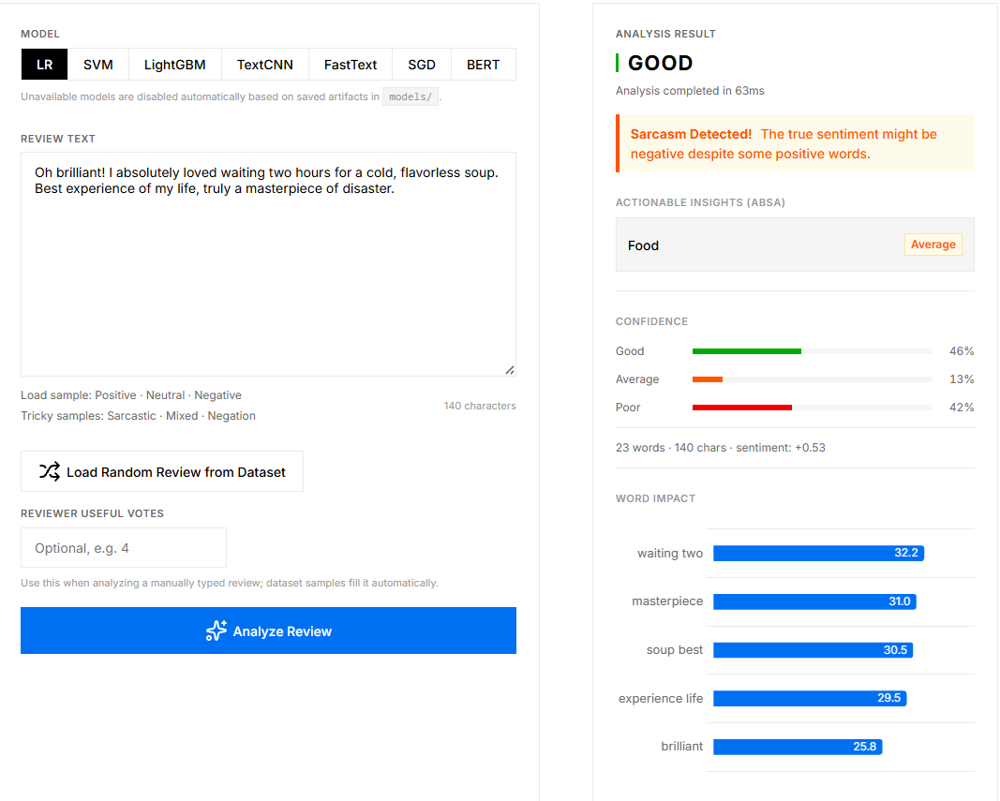
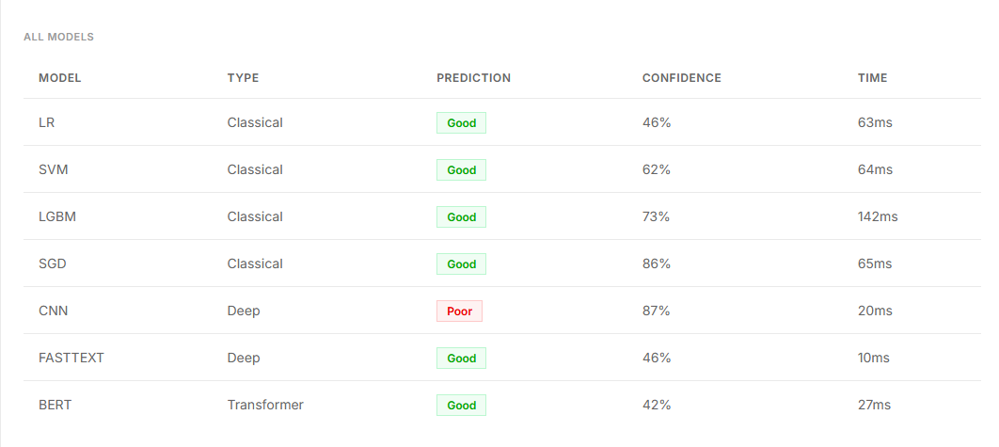

# Quality Estimation from Restaurant Reviews (Yelp Dataset)


## Project Overview
This project aims to predict the quality/sentiment rating of restaurant experiences (Good, Neutral, Bad) strictly from the textual content of user reviews. Utilizing a massive subset of the **Yelp Open Dataset (~1.6 Million reviews)**, we process raw text into numerical features using advanced Natural Language Processing (NLP) techniques and train both traditional Machine Learning and deep Neural Network architectures from scratch.

A full **Flask Web Application** is included, providing an elegant and modern user interface to interact with the models via single text input, bulk CSV upload, and detailed exploratory data analysis.

## Technology Stack
* **Language:** Python 3.13
* **Data Processing:** Pandas, NumPy, SciPy
* **NLP & Text Mining:** NLTK, TextBlob, TF-IDF
* **Machine Learning:** Scikit-learn (Logistic Regression, SVM), LightGBM
* **Deep Learning:** TensorFlow & Keras (LSTM, BiLSTM)
* **Web Backend:** Flask
* **Visualization:** Matplotlib, Seaborn, Plotly

## Reproducible Setup

Create a virtual environment and install the project dependencies:

```bash
python -m venv .venv
.venv\Scripts\activate
pip install -r requirements.txt
```

Run the notebooks in order from `01_data_preparation.ipynb` through `08_bert_model.ipynb`. `04_feature_extraction.ipynb` creates the official train/validation/test indices before fitting TF-IDF, numeric scaling, or tokenization. Vectorizers and scalers are fit only on the training split, then validation/test rows are transformed with those fitted objects.

## Model Architectures
We designed and trained multiple models to evaluate sparse representations, dense sequence models, and a Transformer baseline:
1. **Logistic Regression (Baseline):** Trained on TF-IDF sparse matrices.
2. **Support Vector Machine (LinearSVC):** Calibrated SVC on TF-IDF.
3. **LightGBM:** Gradient Boosting framework on TF-IDF.
4. **SGD Classifier:** Linear large-scale baseline on TF-IDF.
5. **TextCNN / FastText:** Neural sequence baselines trained on padded token sequences.
6. **LSTM / BiLSTM:** Recurrent neural sequence models.
7. **DistilBERT:** Transformer model fine-tuned on a hardware-friendly subset of the official training split and evaluated on the official test split.

*(Note: Deep Learning models were trained on subsets to optimize CPU training times, whereas classical ML models and LightGBM digested the entire 1.14M training corpus).*

## Key Results & Metrics
Evaluated on a completely unseen test set, distinguishing between 3 highly subjective classes:
* **0 (Bad / Kötü)**
* **1 (Neutral / Orta)**
* **2 (Good / İyi)**

The best classical models reach around **80% accuracy/F1** on a subjective 3-class NLP task. Logistic Regression, SVM, and LightGBM are strong classical baselines; DistilBERT is evaluated with the same official test indices.

## Project Structure (Pipeline)

The project is heavily modularized into 7 sequential Jupyter Notebooks and a Web Application:

* `01_data_preparation.ipynb` : Data ingestion, filtering for "Restaurants", and undersampling to balance classes.
* `02_eda.ipynb` : Exploratory Data Analysis, n-gram generation, and word clouds.
* `03_text_preprocessing.ipynb` : Text cleaning, lemmatization, stopword removal, and text-based feature engineering (TextBlob polarity).

* `04_feature_extraction.ipynb` : Leakage-safe split creation, TF-IDF vectorization, numeric scaling, and Keras Tokenizer sequence padding.
* `05_model_training.ipynb` : Model architecture definitions and training across all algorithms.
* `06_model_evaluation.ipynb` : Multi-model comparison, ROC curves, Precision-Recall curves, Radar charts, Confusion Matrices.
* `07_aspect_based_sentiment.ipynb` : Aspect-Based Sentiment Analysis (ABSA) for identifying specific features (food, service, price, etc.) and their polarities.
* `app/` : Contains the Flask backend (`app.py`), static assets (CSS/JS), and modern HTML templates for the Web UI.

## Web Interface Features
- **Real-time Prediction:** Compare how different models (LightGBM, SVM, LR) predict the sentiment of your live text input.
- **Bulk Analysis:** Upload a CSV of reviews and get detailed charts predicting the overall sentiment distribution.
- **EDA Dashboards:** Beautiful, interactive graphs showing word clouds, n-grams, and class distributions from the Yelp dataset.

### Web App Screenshots

**Real-Time Prediction Interface**


**Model Comparison Interface**

